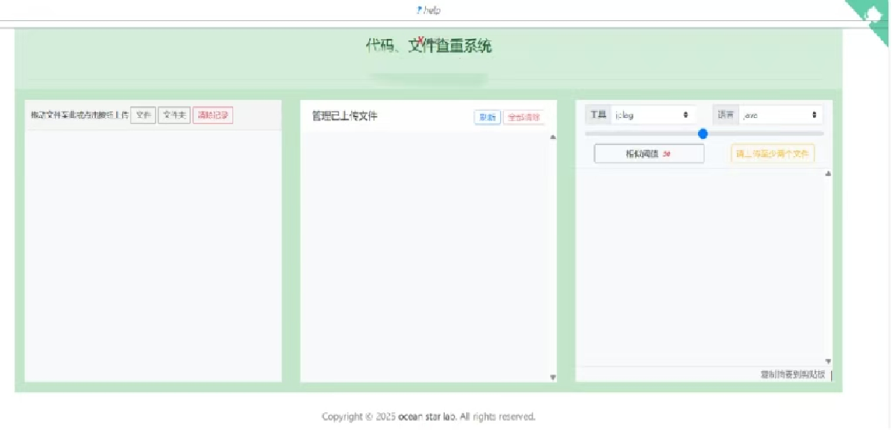

# antiplag-web 程序代码、文档相似度检查软件
该软件是antiplag查重软件的web版后端，能对代码（java、c、c++、python等）、文档（txt、doc、docx、pdf等）之间的相似度进行比较分析，输出相似度高的代码、文本，进而辅助发现学生之间互相抄袭的行为。

## JDK及版本
[jdk11](https://www.oracle.com/technetwork/java/javase/downloads/jdk11-downloads-5066655.html)  
python12 （建议安装anaconda2024，使用semhash时需要安装）
## 安装
直接下载或clone项目源代码，项目源代码可以直接导入idea。  
为了支持python的semhash算法，需要执行以下安装命令：  
pip  install semhash  

系统在window11，jdk11 64位下开发、运行。

## 使用
该软件是后端，需要前端软件配合使用。程序主界面如下：
 
  
## 原理
系统采用的主要技术有：前端vue2 ，后端：springboot，数据库为mysql。
字符串相似度比较算法、代码词法语法解析、bm25、semhash算法。

### 代码的相似度比较基于2个开放开源系统：
* 一是基于网络服务的[MOSS系统](http://theory.stanford.edu/~aiken/moss/)（斯坦福大学开放的支持多种编程语言代码相似度比较的系统）;
* 二是本地执行的[jplag系统](https://github.com/jplag/jplag/)（支持java、c/c++、python等语言的相似度比较）。
本系统在它们基础上进行了二次开发和封装，针对moss系统，开发出了客户端存取模块，实现了代码文件提交、结果获取和解析、结果排序等功能；针对sim和jplag，则将其集成到系统中，在moss因网络故障等原因不可用时，可作为替代产品使用。

### 中英文文档的相似度比较基于3个开源系统：

* 第一种是基于[semhash](https://github.com/MinishLab/semhash)（ 支持文本语义相似度检查）
* 第二种是基于[lucence](https://github.com/apache/lucene)（bm25算法的相似文本检索）
* 第三种是基于jplag的GST算法，对其功能进行了扩展，增加的“doc”语言类型，可以对各种文档进行相似度计算，并提供基于网页的可视化比对功能。

### 参考文献：
1. [Software Plagiarism Detection Techniques:A Comparative Study](http://www.ijcsit.com/docs/Volume%205/vol5issue04/ijcsit2014050441.pdf)
2. [JPlag: Finding plagiarisms among a set of programs](http://page.mi.fu-berlin.de/prechelt/Biblio/jplagTR.pdf)
3. [Winnowing: Local Algorithms for Document Fingerprinting](http://theory.stanford.edu/~aiken/publications/papers/sigmod03.pdf) moss系统采用的核心算法
4. [软件抄袭检测研究综述](https://faculty.ist.psu.edu/wu/papers/spd-survey-16.pdf)

## TODO
1. 支持图片文件查重。 

源于开源，还于开源，开源是美德，加星也是美德 :smile: 。

## 更新情况
1. 2025.4.16 第一版

 